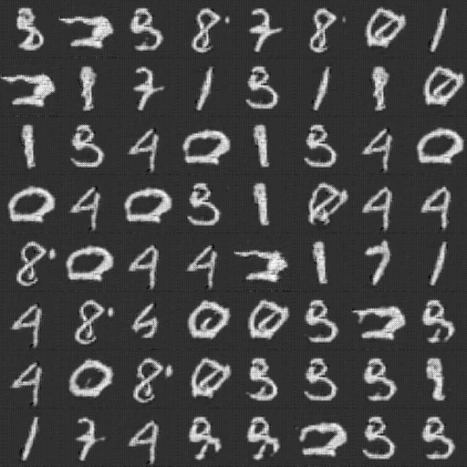
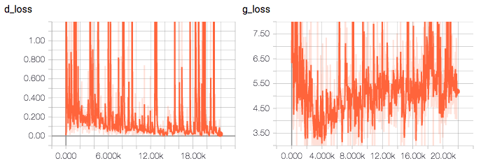
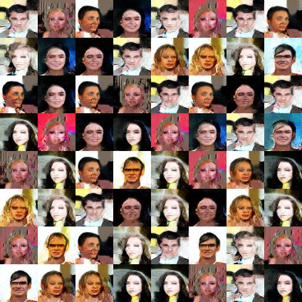
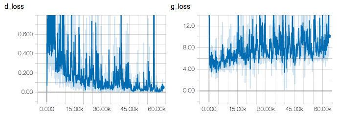
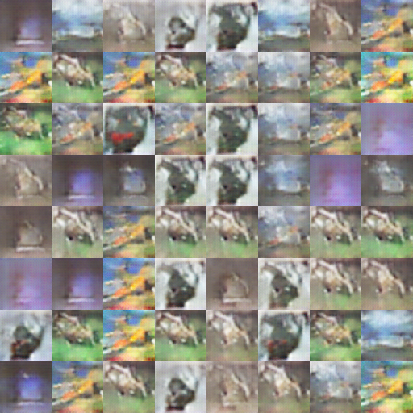
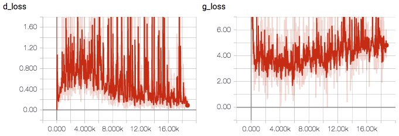

# DCGAN-Tensorflow
SImple Tensorflow implementation of "Deep Convolutional Generative Adversarial Networks" 

## Usage
### Download Dataset
```bash
> python download.py celebA lsun
```

* `mnist, cifar10` are in keras... So, you don't have to download it


```bash
> python main.py --dataset celebA
```

## Results (epoch = 20, lr = 0.0002, batch_size = 64, z_dim = 100)
### mnist



### celebA



### cifar10



## Author
Junho Kim
